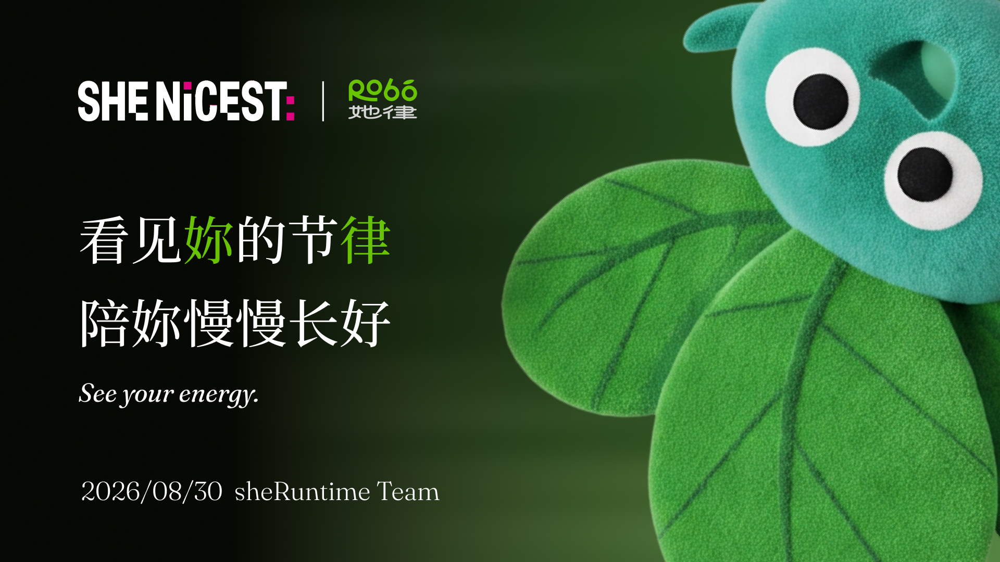

<div align="center">

# SheRuntime · 她律

**看见妳的节律，陪妳慢慢长好。**

个人身体学习系统 · iOS App + 圆形智能硬件

[Web App Demo](https://noneonnone.github.io/Robo-web-demo/) · [StopWatch Demo](https://noneonnone.github.io/Robo-web-demo/stopwatch.html) · [产品与体验指南](./docs/SheRuntime产品说明与体验指南.md) · [能量地图说明](./docs/energy-map-hrv-spec.md)

</div>



## 产品简介

SheRuntime 将三类信息放进同一条身体时间线：Apple Watch / HealthKit 的客观信号、圆形硬件记录的主观感受，以及手机端补充的生活上下文。

它不替用户判断身体，而是帮助用户逐渐发现：自己什么时候更有能量，哪些情境更常与疲惫同时出现，以及今天与过去的自己相比发生了什么变化。

## 核心能力

- **今日时间线**：共同呈现身体指标、语音记录和生活事件。
- **能量地图**：基于 HealthKit 数据观察个人状态随时间的变化。
- **快速记录**：通过手机或圆形硬件完成录音、转写、确认与编辑。
- **StopWatch**：用圆形随身硬件在感受发生的当下快速记录，并通过 BLE 将音频传输到 iPhone。
- **个人洞察**：描述个人规律，只与自己的历史状态比较。
- **本地优先问答**：确定性问题在设备端回答，需要归纳时才调用 LLM。
- **依据可追溯**：展示回答是否使用了本地数据、本地知识和大语言模型。

## 当前完成情况

- Web App Demo，可直接通过浏览器体验核心流程；
- StopWatch Web Demo，用于展示圆形硬件的界面与记录交互；
- iOS 五个核心页面：今日、地图、洞察、问问、我的；
- HealthKit 授权、数据读取与能量计算；
- 手机语音采集、系统转写和本地记录；
- 圆形硬件 BLE 连接与真实麦克风音频流；
- 本地身体指标知识库与问答路由；
- DeepSeek 服务端代理、结构化响应、HTTPS 部署与 API Key 鉴权。

## 快速体验

### Web Demo

访问 [在线原型](https://noneonnone.github.io/Robo-web-demo/)，即可体验主要页面和交互。该版本使用预置数据，不读取访问者的 HealthKit 数据，也不调用受限的大语言模型服务。

### StopWatch Demo

访问 [StopWatch 在线原型](https://noneonnone.github.io/Robo-web-demo/stopwatch.html)，可独立体验圆形硬件的界面、能量状态和快速记录流程。

StopWatch Demo 用于呈现硬件端的交互概念；真实硬件版本已打通 BLE 连接与麦克风音频流，可将记录传输到 iPhone，完成转写、确认并进入个人时间线。

### 真实数据与 LLM

完整体验需要内部 iOS 构建、iPhone、Apple Watch / HealthKit 数据及团队圆形硬件。大语言模型接口已鉴权，目前仅组内一名开发者持有可用凭据，由该开发者进行现场演示。

具体流程见 [产品说明与体验指南](./docs/SheRuntime产品说明与体验指南.md)。

## 项目结构

```text
apps/ios/sheRuntime/   iOS App
demo/webapp/           Web Demo
firmware/stopwatch/    圆形硬件固件
server/app/            Ask 问答服务
knowledge/             本地身体知识库
deploy/tencent-cloud/  服务部署配置
docs/                  产品与技术文档
```

## 本地开发

### Web Demo

```bash
python3 -m http.server 8080 --directory demo/webapp
```

打开 `http://localhost:8080`。

### Ask Server

```bash
cd server/app
pnpm install
cp .env.example .env
pnpm dev
```

真实模型调用需要在 `.env` 中配置内部凭据。请勿提交密钥。

### iOS App

使用 Xcode 打开：

```text
apps/ios/sheRuntime/sheRuntime.xcodeproj
```

命令行编译：

```bash
cd apps/ios/sheRuntime
xcodebuild -project sheRuntime.xcodeproj -scheme sheRuntime \
  -destination 'platform=iOS Simulator,name=iPhone 17 Pro' \
  build CODE_SIGNING_ALLOWED=NO
```

HealthKit、蓝牙和硬件音频链路需要在 iPhone 真机上体验。

## 数据与产品边界

- 仅发送与问题相关、经过裁剪的摘要上下文；
- 不向问答服务发送原始录音、完整本地数据库或无关 HealthKit 样本；
- DeepSeek 密钥只保存在服务端，客户端使用独立的 Ask API Key；
- 当前未接入在线外部搜索；
- 产品只描述个人规律，不提供医学诊断、治疗建议或健康风险判断。

## 团队

- **艾瑞 / arieslx**：开发负责人
- **Ginger**：产品
- **小南**：视觉设计
- **小花、狮宝**：营销与运营

（晚点补充，要回家了！！！）

## License

[MIT](./LICENSE)
