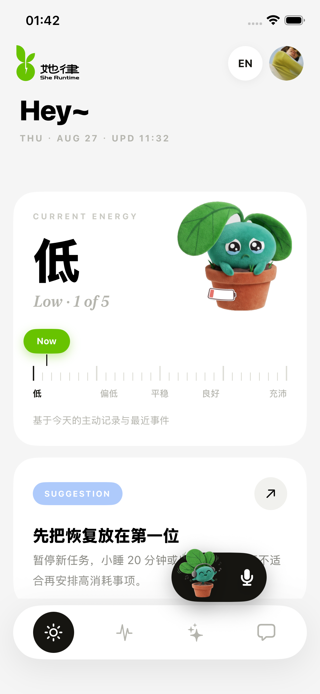
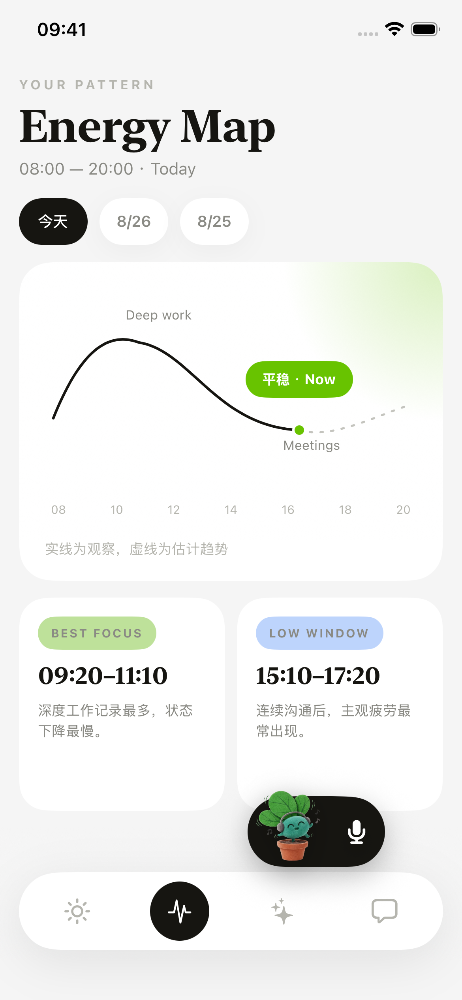
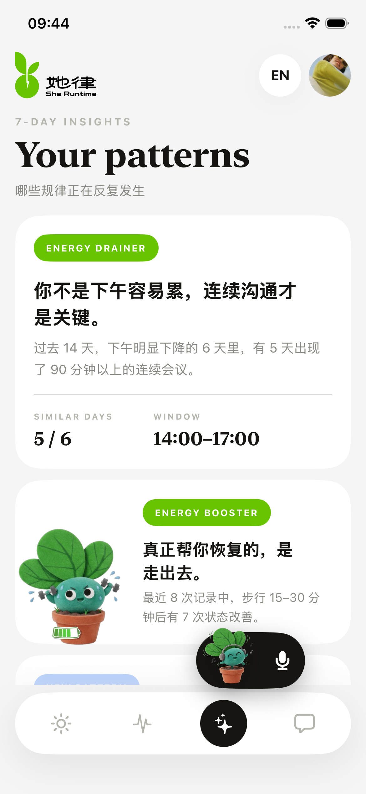
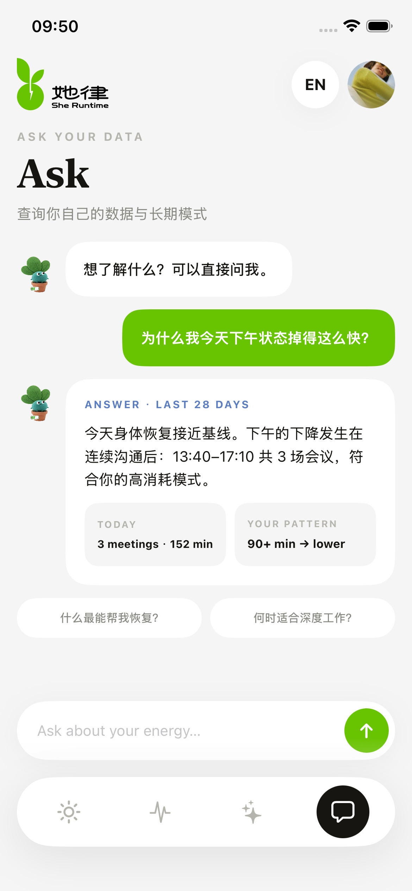
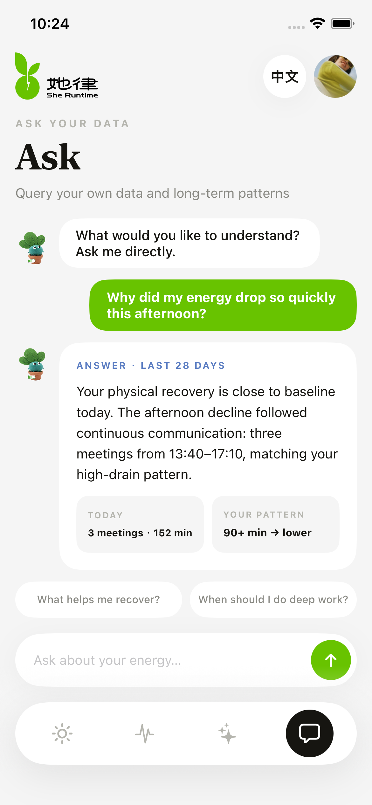

# sheRuntime 黑客松参赛提交文档

## 1. 选择的赛道及命题

- 赛道：软件赛道
- 命题：多端多设备协同的个人身体学习系统

## 2. 作品名称

sheRuntime

## 3. 作品 Slogan

读懂你自己的身体规律

## 4. 作品描述

sheRuntime 是一套面向个人身体数据理解的多端多设备协同系统。
它把 Apple Health / HealthKit、语音记录、M5Stack StopWatch 硬件以及 iPhone 端的主观记录整合到同一条身体时间线中，帮助用户从自己的历史数据里发现状态变化、日常节律和高消耗场景。

项目不是单点 demo，而是已经形成了从数据采集、个人基线、趋势分析、问答解释到隐私控制的完整链路。系统目前包含 iOS App、Node.js 问答服务和 M5Stack 停表硬件三部分，强调本地数据、个人基线和可解释输出，不给医学结论，不用通用人群标准替代个人观察。

## 5. 项目图片

建议提交以下截图：

### Today

### Map

### Insights

### Ask

### Ask EN

## 6. GitHub 代码仓库

- 仓库地址：<https://github.com/arieslx/she-runtime>
- GitHub Topic：`shenicest-fission`

> 提交前请确认仓库已按要求设置 Topic，GitHub Topic 填写时不需要带 `#`。

## 7. 项目文档

### 7.1 项目背景

很多个人健康数据分散在不同设备和应用里：Apple Health 记录的是客观身体信号，语音记录保存的是主观感受，硬件设备能承载更即时的交互和采集入口，但这些信息往往没有被串成一条连续的个人时间线。

sheRuntime 想解决的是“我今天为什么这样”的问题。它不尝试替用户做医学判断，而是把身体恢复、活动、沟通负荷、语音记录和设备数据放在一起，帮助用户看到自己的规律。

### 7.2 目标用户

- 经常高强度工作、希望理解自己状态变化的人
- 有 Apple Watch / iPhone / M5Stack 等多设备使用场景的人
- 希望把身体感受、行为事件和健康数据放到一起看的人
- 关注个人数据隐私、希望本地优先处理的人

### 7.3 技术栈

- iOS 端：SwiftUI、SwiftData、Swift Concurrency、HealthKit、CoreBluetooth、语音输入与录音服务
- 硬件端：M5Stack、Arduino / PlatformIO、BLE 音频传输、M5Unified
- 服务端：Node.js 20、Express、DeepSeek API 代理服务、JSON 输出校验
- 测试：Swift Testing、Node.js 内置测试

### 7.4 创新点

1. 个人基线优先，不用人群平均值替代个人判断。
2. 多端多设备协同，把 iPhone、健康数据、语音记录、M5Stack 硬件和服务器串成一套流程。
3. 问答结果可解释，明确标注本地数据、本地知识和模型路径。
4. 产品表达保持克制，不输出医学结论，只呈现个人规律和趋势。
5. 以时间线为核心组织信息，把状态变化、事件和恢复窗口放在同一视图里理解。

### 7.5 团队分工

- 艾瑞（arieslx）：整体技术方案、iOS / 服务端 / 硬件协同、核心实现
- Ginger：产品定义、交互目标、功能取舍
- 小南：视觉设计、界面表现、页面一致性
- 小花：参赛文案、项目表达、对外物料
- 石宝：参赛文案、传播整理、提交材料协助

### 7.6 开发过程

1. 先确定产品方向：不是做通用健康工具，而是做“个人身体学习系统”。
2. 完成 iOS 主应用框架，整理 Today / Map / Insights / Ask / Profile 等页面。
3. 将页面文案统一收敛到 JSON，降低后续改字和多语言维护成本。
4. 建立 HRV 能量地图的计算与展示链路，让趋势计算有独立的规格和测试。
5. 搭建 Ask 服务，用 Node.js 代理模型请求，结合本地知识和个人上下文回答问题。
6. 接入 M5Stack StopWatch 的 BLE 音频链路，形成硬件侧的数据协同。
7. 补齐隐私说明、权限管理和数据访问入口，让用户能理解并控制数据来源。

### 7.7 后续计划

- 接入更多真实数据源，继续补全端到端联动
- 增强问答结果与个人历史记录的关联能力
- 完善硬件端稳定性、连接确认和容错流程
- 继续补充测试、演示视频和可直接体验链接
- 根据比赛反馈进一步收敛成更稳定的产品版本

## 8. 作品演示视频

- 视频链接：待补充

## 9. 可直接体验项目的链接

- 在线体验链接：待补充

## 10. 备注

当前仓库已包含 iOS 截图素材、服务端代码与硬件固件代码，可直接用于参赛材料整理。
如需，我可以继续把这份文档改成更适合主办方提交表单的“精简版”或“宣传版”。
